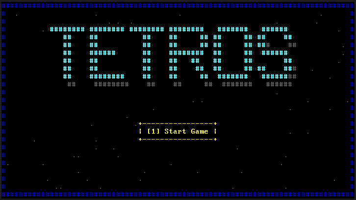
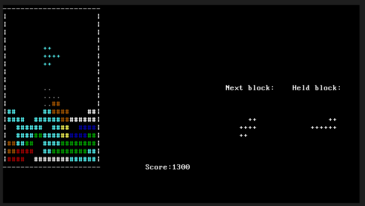
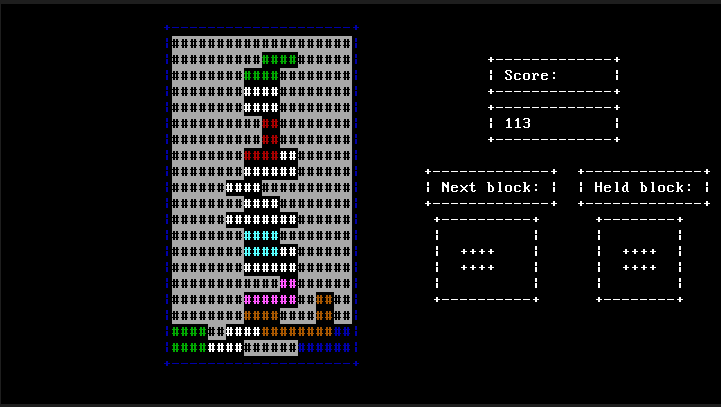
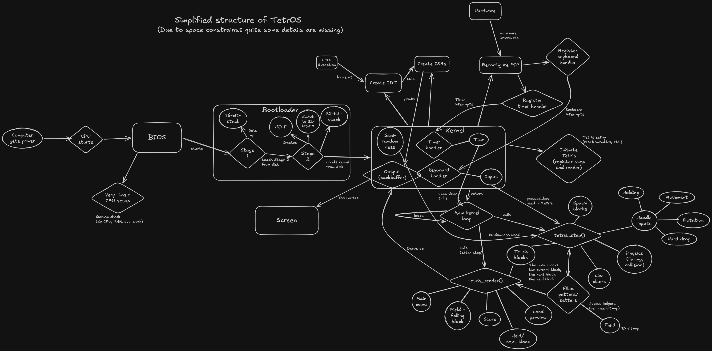

# TetrOS

TetrOS is a simple, educational OS that boots directly on x86 hardware or in a virtual machine and runs a playable version of Tetris with all known features.

| Main Menu | Playing | Game over |
|---------|---------|--------|
||  |  |

## Overview

- [TetrOS](#tetros)
  - [Overview](#overview)
  - [Features](#features)
  - [Getting Started](#getting-started)
    - [Prerequisites](#prerequisites)
    - [Building](#building)
  - [Running](#running)
    - [Controls](#controls)
  - [Architecture](#architecture)
  - [License](#license)
  - [Disclaimer](#disclaimer)

---

## Features

- Custom bootloader written in Assembly (16-bit real mode -> 32-bit protected mode)
- 32-bit protected mode kernel
- CPU exception handling
- Keyboard input handling
- Timer handling
- Text-mode graphics (VGA)
- Timer interrupts and event system
- Fully playable Tetris game (with movement, holding, hard drop, land preview)
- Color
- Runs on real hardware or in VirtualBox/QEMU

---

## Getting Started

### Prerequisites

- **NASM** (Netwide Assembler)
- **a cross compiler** (e.g. i686-elf-gcc)
- **Make** (GNU Make)
- **VirtualBox** or **QEMU** (for emulation/testing)

### Building

1. Build:
   ```bash
   make
   ```
   or to create a Floppy disk:
   ```bash
   make image
   ```

## Running
The build process creates a bootable image `TetrOS.bin`
You can boot this image in a VM-Software (VirtualBox, QEMU, etc.) or write it to a USB drive for real hardware (use with caution, not tested).

In case of VirtualBox use the `TetrOS.img` floppy disk image

### Controls
Press 1 to start the game.


- A: Move block left
- D: Move block right
- S: Move block down
- Q: Rotate block left
- E: Rotate block right
- C: Hold/ switch block
- space: Hard drop (instant move to bottom)


## Architecture


The field is made with a 1D bitmap. Each cell has 4 bits: 1 for filled/empty and 3 for color (8 colors). The field is 10 cells wide and 20 cells high.

## License
This project is licensed under the MIT license. See the [LICENSE](LICENSE) for details.

## Disclaimer
**Tetros is inspired by the gameplay of Tetris but is entirely original.**    
This project is **not affiliated with or endorsed by The Tetris Company**, and does **not use any official Tetris assets.**